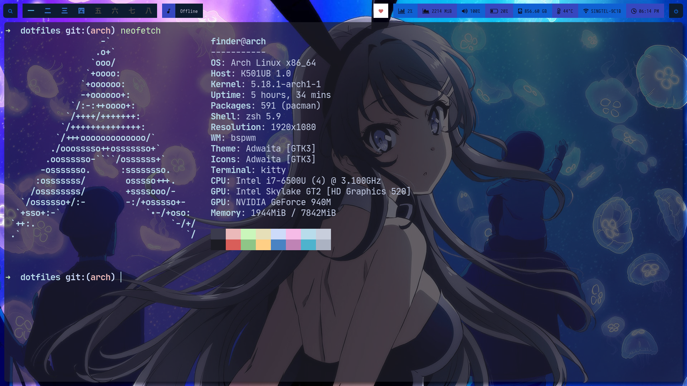

# 0xfinder's dotfiles

Repository for my personal dotfiles, yes. 

## Packages

- Kitty (Shell)
- Git (VCS)
- Htop (Process viewing)
- Mpd (Music daemon)
- Picom (Window Compositor)
- Polybar (For status bars)
- Neovim (Editor)
- Xorg (X settings)
- VSCode (IDE)
- Bspwm (Window manager)
- Neofetch (Fetcher)

## Screenshot

